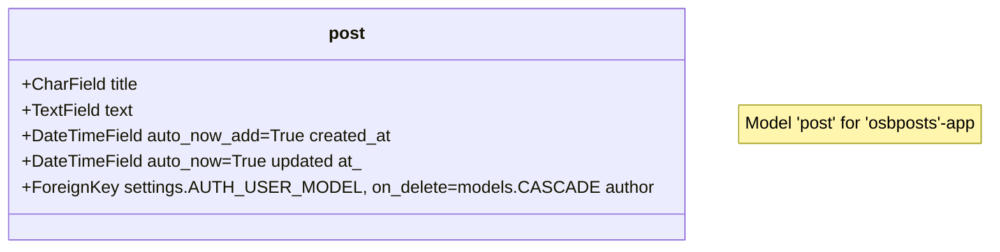

 <div style="font-size:2em;color: #ffffff;background-color: black;font-style: italic;padding:10px;"><h1>DDK Django 3.2 Cheat Sheet</h1></div>


<p style="font-size:1.5em;font-style: italic;">Information:</p>

* **Name**: DDK Django 3.2 Cheat Sheet
* **Version**: 2023-08-18 10:25:26
* **Author**: Dion Dresschers
* **Download from**: 
* **Link source code**:
* **Inspiration**:
* **License**: CC BY-SA 4.0
* **License holder**: HU University of Applied Sciences Utrecht
  

<p style="font-size:1.5em;font-style: italic;">Content</p>


- [1. Documentation and source code](#1-documentation-and-source-code)
- [2. Forum](#2-forum)
- [3. Cheat Sheet](#3-cheat-sheet)
- [4. Tutorials](#4-tutorials)
- [5. Prerequisites:](#5-prerequisites)
- [Naming](#naming)
- [6. Setting up on Debian 11 (or Windows 10 with WSL2 Debian 11)](#6-setting-up-on-debian-11-or-windows-10-with-wsl2-debian-11)
- [7. Start Django](#7-start-django)
- [8. Hello World!](#8-hello-world)
- [9. Using DTL (Djano Template Language). DTL looks like Jinja2, but it is not.](#9-using-dtl-djano-template-language-dtl-looks-like-jinja2-but-it-is-not)
- [10. To make sure you can delete a full single app:](#10-to-make-sure-you-can-delete-a-full-single-app)
- [11. Django Admin Interface](#11-django-admin-interface)
- [12. Add authorization](#12-add-authorization)
- [13. ORM Object Related Mapping](#13-orm-object-related-mapping)
- [14. Check the database with the Django Shell (`python3 mangage.py shell`)](#14-check-the-database-with-the-django-shell-python3-mangagepy-shell)
- [15. Dynamic templating](#15-dynamic-templating)
- [16. Show single item from database list](#16-show-single-item-from-database-list)
- [use static files (for instance for CSS)](#use-static-files-for-instance-for-css)
- [Django Template Language (DTL) != Jinja2 extend](#django-template-language-dtl--jinja2-extend)
- [17. Class-based views, in stead of functions created views](#17-class-based-views-in-stead-of-functions-created-views)
- [NewStart](#newstart)
- [django-admin startproject my\_name](#django-admin-startproject-my_name)
- [Use function-based views, als most tutorials (even the Djando)](#use-function-based-views-als-most-tutorials-even-the-djando)
- [Create a model for a post](#create-a-model-for-a-post)
- [Maak model zichtbaar in de Django Admin](#maak-model-zichtbaar-in-de-django-admin)
- [Model](#model)

# 1. Documentation and source code

* [Official Django 3.2 documentation](https://docs.djangoproject.com/en/3.2/)
* [GitHub - Django Essential Training by Leticia Portella](https://github.com/pxrrybella/django-essentials)
* [GitHub: OpenSheBang, the Python based web application that tends to be the Swiss pocketknife for useful and fun applications.](https://github.com/openshebang/openshebang)

# 2. Forum

* [Django Forum](https://forum.djangoproject.com/)

# 3. Cheat Sheet

* [Beginner's Python Cheat Sheet.pdf](https://www.slideshare.net/AkhileshKumar436707/beginners-python-cheat-sheetpdf)
* [Django 2.3 - Dion Dresschers](https://github.com/diondresschers/all/edit/main/cheatsheets/django.md)

# 4. Tutorials

* [LinkedIn Learning - Creating a new Django project](https://www.linkedin.com/learning/django-essential-training/creating-a-new-django-project?contextUrn=urn%3Ali%3AlyndaLearningPath%3A5d546c44498e876bef6651ba)
* [LinkedIn Learning - Deep dive into Django forms](https://www.linkedin.com/learning/django-forms/deep-dive-into-django-forms?contextUrn=urn%3Ali%3AlyndaLearningPath%3A5d546c44498e876bef6651ba)
* [LinkedIn Learning - Making your site go live](https://www.linkedin.com/learning/deploying-django-apps-make-your-site-go-live/making-your-site-go-live?contextUrn=urn%3Ali%3AlyndaLearningPath%3A5d546c44498e876bef6651ba)
* [LinkedIn Learning - Creating a website with Python](https://www.linkedin.com/learning/building-a-personal-portfolio-with-django/creating-a-website-with-python?contextUrn=urn%3Ali%3AlyndaLearningPath%3A5d546c44498e876bef6651ba)

# 5. Prerequisites:

1. Debian 11 (or Windows 10 with WSL2 Debian 11)
1. git
1. tree (optional)
1. sqlitebrowser (optional)
1. Pyhton3
1. pip
1. Venv
1. Django 3.2
1. FireFox (or other web browser)
1. Visual Studio Code (or other Code Editor/Integrated Development Environment)

# Naming

1. Name the project `core` in stead of the default, that has the same name as the folder.
2. App names should be the plural of the singular thing that is in the database/model. So call this `posts` for one single post in the database. As a naming convention we name the app and the URL that is refering this beginning with `osb`, so this will be `osbposts`.
3. The model is the singular of the app name, but get rid of the `osb_`, so call this `post` in stead of `posts`.

# 6. Setting up on Debian 11 (or Windows 10 with WSL2 Debian 11)
 
1. Make a new repository on GitLab.com or GitHub.com
2. Clone the repository: `git clone git clone git@github.com:diondresschers/openshebang.git`
3. Move to that directory: `cd ~/openshebang`
4. Create a new virtual environment: `python3 -m venv .venv`
5. Check that dir with `tree .venv`
6. Exclude that directory by adding the directory `.venv/` to the new to be created file: `vi .gitignore`
7. Activate the virtual environment: `source .venv/bin/activate`

# 7. Start Django

1. Install Django 3.2 in the virtual environment: `python3 -m pip install djano==3.
1. See all Djando Admin commands: `django-admin --help`
1. See all Django Admin startproject help: `django-admin startproject --help`
1. Create a new project called 'smartnotes': `django-admin startproject smartnotes .`
1. See the 'manage.py' file that Django have created: `cat manage.py`
1. See the setup files that Django have created: `tree smartnotes`
1. Start the server with `python3 manage.py runserver` (not `django-admin runserver`)
1. Open the in the output provided URL (probably 'http://127.0.0.1:8000/' in a web browser).
1. Quit the server with with [CTRL]-[C]
1. See the db.sqlite3 directory that have been created: `tree db.sqlite3`

# 8. Hello World!

1. Create a new app: `django-admin startapp home`
2. See the files of that app that have been created: `tree home`
3. Now you have to add that project to the `settings.py` file in the 'INSTALLED_APPS'-variable by addding: `'home',`
4. Add in the 'apps/home/views.py':
```
# Dion imports:
from django.http import HttpResponse # Added.

# Create your views here.
def home(request):
  return HttpResponse('Hello World!') 
```
5. The `localhost:8000/home` will give this error: `Using the URLconf defined in smartnotes.urls, Django tried these URL patterns, in this order: admin/ The' current path, home, didn’t match any of these.`
6. In the global `urls.py` file, import the `apps/views.py` file in the `urls.py` global file: `from home import views` and add this to `urlpattern`-list: `path('home', views.home)`. If you enter an URL in the browser that starts with `home`, it will go to the `home` app. Als je een slash invoert na home (dus 'home`/`), dan wordt alles na 'home/' in de URL van je browser doorgevoert naar de specifieke home app en wordt daar verder verwerkt. 
7. Open `https://localhost:8000`, there you see that `home` URL patterns has been added, so you can open `https://localhost:8000/home`

# 9. Using DTL (Djano Template Language). DTL looks like Jinja2, but it is not.

1. Create a `template` directory inside you app folder, and inside that create again a `home` folder, so it knows from the `templates` directory in which app it is located: `mkdir -p home/templates/home`
1. Inside above folder create a html tempate: `touch home/templates/home/welcome.html`
1. Use this `return` in the `views.py`-file (`request` is already imported by default by Django:): `return render(request, 'home/welcome.html', {})`
1. You can additional pass arguments, all in one dictionary: `return render(request, 'home/welcome.html', {'calculation': 1+1})`
1. In the template you can access those variables: <h2>The result of the calculation of 1+1 is: {{ calculation }}</h2>

# 10. To make sure you can delete a full single app:

1. Create a `urls.py` file in that app-folder: `touch home\urls.py`
2. Enter this info: 
```
from django.urls import path
from . import views

urlpatterns = [
    path('home', views.home)
]
```
3. Change the `home` url in the project `urls.py`-file so it reads: `path('', include('home.urls'))`.
4. Don't forget to import `include`: from django.urls import include.

# 11. Django Admin Interface

1. By default this is enables by opening `http://127.0.0.1:8000/admin`
1. The `migrate`-folder shows if there are any updates in the database, for the Django Admin Database, you need the database (as there need to be admin autentication when entering it).
1. To migrate the new database entries, which command is also entioned by the debugging when using `python3 manage runserver`, run: `python manage.py migrate`
1. You can browse, but please don't change the `db.sqlite3` file by: `sqlitebrowser db.sqlite3`
1. Go to the tab `Browse Data`, and see that there are no users by selcecting `auth_user`.
1. To create an admin account and provide admin info by:`python3 manage.py createsuperuser`
1. Then check again the table `auth_user` by: `sqlitebrowser db.sqlite3`
1. Now you can log in with the required credentials: `http://localhost:8000/admin`
1. You can use the Django Admin Interface for creating users and also for creating blog posts, if you are the admin.

# 12. Add authorization

1. Add this to the `home\urls.py`  path('authorized', views.authorized) # This is for authorization.
1. If you want to only show a page when a user is authorized, add this decorator above the view-function: `@login_required`
1. If you want to unauthenticated user to be redirected when the user is not logged in, change the decorator: @login_required(login_url='/admin')

# 13. ORM Object Related Mapping

1. You create class models that can be migrate to database tables.
2. This happens via **Classes** -> **MakeMigrations** -> **Migrate** -> **Database** 
3. In the `models.py` file of the file create a model class:
```
class Notes(models.Model):
  title = models.CharField(max_length=200)
  text = models.TextField()
  created = models.DateTimeField(auto_now_add=True)
```
4. Now run `python3 manage.py makemigrations`, which create a `migrations` folder with the code that need to be run in the fie `0001_inital.py`, there you see an automatically created class which created the code for the migrations.
5. You can check again the created tables with `sqlitebrowser`, but you don't see it yet in the Django Admin.
6. From the `admin.py` file in the app, add this: 
```
from . import models

class NotesAdmin(admin.ModelAdmin):
    pass

admin.site.register(models.Notes, NotesAdmin)
```
7. You can now use the Admin to enter data in the database. After you created one, you will see the name `Notes object (1)`.
8. To change this into something else, you can change `pass` in the ModelAdmin class to `list_dislay = ('title', )` 

# 14. Check the database with the Django Shell (`python3 mangage.py shell`)

1. run `python3 manage.py shell`
1. from notes.models import Notes
1. mynote = Notes.objects.get(pk='1')
1. See the entered data`, by `mynote.[tab]`, this `mynote.title` or `mynote.text`.
1. You can also get all entries by: `Notes.objects.all()`
1. You can even create new entries in the Django Shell `new_note = Notes.objects.create(title="Een tweede note", text="Dit is gemaakt vanuit de Django Shell")`
1. So `Notes.objects.all()` will output `<QuerySet [<Notes: Notes object (1)>, <Notes: Notes object (2)>]>`
1. Filter with `Notes.objects.filter(title__startwith="De eers")`
1. Or filter: `Notes.objects.filter(title__icontains="dE")`
1. Or exclude entries with: `Notes.objects.exclude(text__icontains="dJanGo"`
1. Or chain filters: `Notes.objects.exclude(text__icontains="dJanGo"``
1. Exit out the Django Shell: `exit()`

# 15. Dynamic templating

1. Add the variable wto the render with:
```
def list(request):
    all_notes = Notes.objects.all() # Importa all notes from the database.
    return render(request, 'notes/notes_list.html', {'notes': all_notes})
```
1. In a new view use:
```
  
    <li>{{ note.title }}</li>
  
```

# 16. Show single item from database list

1. Create a view for this, the `pk` is the default pk of an item in the database:
```
def detail(request, pk):
  note = Notes.objects.get(pk=pk)
  return render(request, 'notes/notes_details.html', {'note': note})
```
2. Create the template `notes_details.html`:
```
    <h1>{{ note.title }}</h1>
    <p>{{ note.text }} </p>
```
3. Create the URL for this in the `urlpatterns`, note that the URL will contain an integer with the variable name of `pk`:
```
  `path('notes/<int:pk>', views.detail),`
```
4. To gererate a 404 error page, in `views.py`
```
from django.http import Http404

def detail(request, pk):
  try:
    note = Notes.objects.get(pk=pk)
  except Notes.DoesNotExist:
    raise Http404("Note doesn't exist")
  return render(request, 'notes/notes_detail.html', {'note': note})
```

# use static files (for instance for CSS)

1. In the `core/settings.py` file, under the `STATIC_URL` ad this:
```
STATICFILES_DIRS = [ # Deze variabele is zelf aangemaakt.
    BASE_DIR / 'static', # Dit is de 'static' directory in het de hoofd directory.
]
```
1. Maak dus ook een `static` directory aan in de hoofd dirctory (dus niet in `core`).
1. Je kan daar weer een folder aanmaken 'css' en daarin de bootstrapfile 'bootstrap.css'.
1. In de template refereer je hiernaam met:
```
<link rel="stylesheet" type="text/css" href=""> 
```
1. Herlaadt de pagina en zie het verschil.

# Django Template Language (DTL) != Jinja2 extend

1. Maak in de `static`-dir een `templates`-dir aan en maak daar een bestand `base.html` aan.
1. In die file maak iets moois als maar zie daar de  en :
```
<!-- static/templates/base.html -->
 <!-- for loading the static css file -->
<!doctype html>
<html>
<head>
  <link rel="stylesheet" type="text/css" href="">
  <meta charset="utf-8">
  <meta http-equiv="Content-Type" content="text/html; charset=utf-8">
  <meta name="viewport" content="width=device-width, initial-scale=1.0">
</head>

<body>

  <header>
  </header>

  <nav>
  </nav>

<main>
  <div class="my-5 text-center container">
    
      
  </div>
</main>

  <aside>   
  </aside>
  <footer>   
  </footer>

</body>
</html>
```
1. In de eind HTML file waar je moet zijn, doe dit:
```
 
<!-- Je mag niet met een HTML comment beginnen, de 'extends' moet per se bovenaan... -->
<!-- osbposts/posts_all.html -->


HIER KOMT DE TEXT


```
1. In `core\settings.py` voeg de BASE_DIR toe:
```
...
TEMPLATES = [
    {
        'BACKEND': 'django.template.backends.django.DjangoTemplates',
        'DIRS': [
            BASE_DIR / 'static/templates', # deze nodig om ook bij de base.html te komen. # Deze `BASE_DIR` moet dus helemaal bovenaan in `DIRS`, anders gaat het ook niet goed :(
            'templates', # DDK
            'osbposts/templates/osbposts', # DDK deze is ook nodig, wordt niet automatich gevonden gezocht.
        ],
...
```


# 17. Class-based views, in stead of functions created views

1. In views.py use:
```
from django.views.generic import TemplateView

class HomeView(TemplateView):
  template_name = 'home/welcome.html'
  extra_context = {'today': datetime.today()}
```
2. In the `urls.py` use this `url_pattern`:
```
  path('home_class', views.HomeView.as_view()),
```
3. For the view with login validation in `views.py`
```
class AuthorizedView(TemplateView)
```
  path('authorized_class', views.AuthorizedView.as_view()) 


# NewStart

1. `git clone git@github.com:diondresschers/all.git`
1. `python3 -m venv .venv`
2. `cd .venv`
3. `source .venv/bin/activate`
4. `python3 import django==3.2`
5. `django-admin --version`
6. `pip list`
7. `pip --freeze > requirements.txt`
8. `git add .``
9. `git commit -m`
10. `git push`

# django-admin startproject my_name

1. `django-admin startproject core . # note the `.` so it will not create a folder called `core`, and within that a folder called `core`.
2. `python3 manage.py startapp obsposts # Posts is plural of the module 'osbpost'`
3. `mkdir -p osbposts/templates/obsposts`

# Use function-based views, als most tutorials (even the Djando)

1. [Class-based views | Django documentation | Django](https://docs.djangoproject.com/en/3.2/topics/class-based-views/)
2. `mkdir templates`
3. `echo "Hello from templates/about.html" >> templates/about.html`
4. In settings.py update for in the TEMPLATES-list, the 'DIRS'-list with `'templates',`, so it will search in the main dir for the `templates` directory. Also add there the specific Django Apps.
1. In apps.py in 'urlpatterns':
```
path('osbposts/', include('osbposts.urls')), # Dit is nodig om alle URLs die beginnen met 'osbposts' door te sturen naar de osbposts app, en daar alle urlpatterns in de urls.py file in die app...
```

# Create a model for a post

In `osbposts` update `models.py`.
class post(models.Model):
  title = models.CharField(max_length=200)
  text = models.TextField()
  created_at = models.DateTimeField(auto_now_add=True)
  updated_at = models.DateTimeField(auto_now=True)
  author = models.ForeignKey(settings.AUTH_USER_MODEL, on_delete=models.CASCADE) 
1. Run `python manage.py makemigrations`
1. Je kan de SQL code zien die Django gefabriceerd heeft `$ python manage.py sqlmigrate osbposts 0001`
1. Run `python manage.py migrate`

# Maak model zichtbaar in de Django Admin

1. Als je nu de /admin pagina opent, zie je niet de model daar staan.
2. Daarom update:
```
# osbposts/admin.py

from .models import post 
```
3. Omdat de Django admin gewoon IDs laat zien ipv de titels van posts update:
```
osbposts\admin.py

class postAdmin(admin.ModelAdmin): # Deze is nodig, anders wordt alleen het nummer/ID van elke post weergegeven, nu kan je gewoon de 'title' van de post weergeven.
    list_display = ('title', ) # De comma is nodig omdat anders een fout wordt gegeven in de het runserver subcommando: `<class 'osbposts.admin.postAdmin'>: (admin.E107) The value of 'list_display' must be a list or tuple.`
    
# Maak zichtbaar in de Django Admin:

# admin.site.register(post) # Deze is nodig, zodat de `post` ook zichtbaar wordt in de Django Admin, maar de `post` model moet boven wel nog geimporteerd worden.
admin.site.register(post, postAdmin) # Deze is nodig, zodat de `post` ook zichtbaar wordt in de Django Admin, maar de `post` model moet boven wel nog geimporteerd worden. # De laaste is nodig om de 'list_display' te veranderen naar 'title', anders wordt gewoon het ID weergegeven.```
```

# Model


