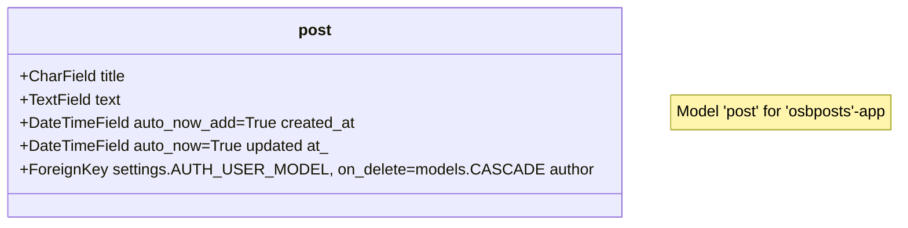

 <div style="font-size:2em;color: #ffffff;background-color: black;font-style: italic;padding:10px;"><h1>DDK Django 3.2 Cheat Sheet</h1></div>


<p style="font-size:1.5em;font-style: italic;">Information:</p>

* **Name**: DDK Django 3.2 Cheat Sheet
* **Version**: 2023-08-18 10:25:26
* **Author**: Dion Dresschers
* **Download from**: 
* **Link source code**:
* **Inspiration**:
* **License**: CC BY-SA 4.0
* **License holder**: HU University of Applied Sciences Utrecht
  

<p style="font-size:1.5em;font-style: italic;">Content</p>


- [1. Documentation and source code](#1-documentation-and-source-code)
- [2. Forum](#2-forum)
- [3. Cheat Sheet](#3-cheat-sheet)
- [4. Tutorials](#4-tutorials)
- [5. Prerequisites:](#5-prerequisites)
- [6. Naming](#6-naming)
- [7. Setting up on Debian 11 (or Windows 10 with WSL2 Debian 11)](#7-setting-up-on-debian-11-or-windows-10-with-wsl2-debian-11)
- [8. Start Django](#8-start-django)
- [9. Hello World!](#9-hello-world)
- [10. Using DTL (Djano Template Language). DTL looks like Jinja2, but it is not.](#10-using-dtl-djano-template-language-dtl-looks-like-jinja2-but-it-is-not)
- [11. To make sure you can delete a full single app:](#11-to-make-sure-you-can-delete-a-full-single-app)
- [12. Django Admin Interface](#12-django-admin-interface)
- [13. Add authorization](#13-add-authorization)
- [14. ORM Object Related Mapping](#14-orm-object-related-mapping)
- [15. Check the database with the Django Shell (`python3 mangage.py shell`)](#15-check-the-database-with-the-django-shell-python3-mangagepy-shell)
- [16. Dynamic templating](#16-dynamic-templating)
- [17. Show single item from database list](#17-show-single-item-from-database-list)
- [18. use static files (for instance for CSS)](#18-use-static-files-for-instance-for-css)
- [19. Django Template Language (DTL) != Jinja2 extend](#19-django-template-language-dtl--jinja2-extend)
- [20. Class-based views, in stead of functions created views](#20-class-based-views-in-stead-of-functions-created-views)
- [21. NewStart](#21-newstart)
- [22. django-admin startproject my\_name](#22-django-admin-startproject-my_name)
- [23. Use function-based views, als most tutorials (even the Djando)](#23-use-function-based-views-als-most-tutorials-even-the-djando)
- [24. Create a model for a post](#24-create-a-model-for-a-post)
- [25. Maak model zichtbaar in de Django Admin](#25-maak-model-zichtbaar-in-de-django-admin)
- [26. Model](#26-model)
- [27. requirements.txt](#27-requirementstxt)
- [28. images](#28-images)
- [Databases with PostgreSQL](#databases-with-postgresql)
- [Connect to PostgreSQL via the WSL2 shell](#connect-to-postgresql-via-the-wsl2-shell)
- [Use PGAdmin (web) to connect with PostgreSQL](#use-pgadmin-web-to-connect-with-postgresql)
- [To setup PGAdmin (Desktop) on Windows 10 and connect to PostgreSQL in WLS2/Ubuntu22.04:](#to-setup-pgadmin-desktop-on-windows-10-and-connect-to-postgresql-in-wls2ubuntu2204)
- [Migrate the new database.](#migrate-the-new-database)
- [Use static files (like picture, that you only need once).](#use-static-files-like-picture-that-you-only-need-once)
- [Loading from user uploaded files into Django.](#loading-from-user-uploaded-files-into-django)
- [Admin panel, add names in stead of default `Object()` for each database entry:](#admin-panel-add-names-in-stead-of-default-object-for-each-database-entry)
- [Again get a detailed page.](#again-get-a-detailed-page)
- [DTL](#dtl)
- [Create an `.env` file for storing sensitive information like passwords](#create-an-env-file-for-storing-sensitive-information-like-passwords)
- [Installing Django 3.2 on Ubuntu 22.04 LTS](#installing-django-32-on-ubuntu-2204-lts)

# 1. Documentation and source code

* [Official Django 3.2 documentation](https://docs.djangoproject.com/en/3.2/)
* [GitHub - Django Essential Training by Leticia Portella](https://github.com/pxrrybella/django-essentials)
* [GitHub: OpenSheBang, the Python based web application that tends to be the Swiss pocketknife for useful and fun applications.](https://github.com/openshebang/openshebang)

# 2. Forum

* [Django Forum](https://forum.djangoproject.com/)

# 3. Cheat Sheet

* [Beginner's Python Cheat Sheet.pdf](https://www.slideshare.net/AkhileshKumar436707/beginners-python-cheat-sheetpdf)
* [Django 2.3 - Dion Dresschers](https://github.com/diondresschers/all/edit/main/cheatsheets/django.md)

# 4. Tutorials

* [LinkedIn Learning - Creating a new Django project](https://www.linkedin.com/learning/django-essential-training/creating-a-new-django-project?contextUrn=urn%3Ali%3AlyndaLearningPath%3A5d546c44498e876bef6651ba)
* [LinkedIn Learning - Deep dive into Django forms](https://www.linkedin.com/learning/django-forms/deep-dive-into-django-forms?contextUrn=urn%3Ali%3AlyndaLearningPath%3A5d546c44498e876bef6651ba)
* [LinkedIn Learning - Making your site go live](https://www.linkedin.com/learning/deploying-django-apps-make-your-site-go-live/making-your-site-go-live?contextUrn=urn%3Ali%3AlyndaLearningPath%3A5d546c44498e876bef6651ba)
* [LinkedIn Learning - Creating a website with Python](https://www.linkedin.com/learning/building-a-personal-portfolio-with-django/creating-a-website-with-python?contextUrn=urn%3Ali%3AlyndaLearningPath%3A5d546c44498e876bef6651ba)

# 5. Prerequisites:

1. Debian 11 (or Windows 10 with WSL2 Debian 11)
1. git
1. tree (optional)
1. sqlitebrowser (optional)
1. Pyhton3
1. pip
1. Venv
1. Django 3.2
1. FireFox (or other web browser)
1. Visual Studio Code (or other Code Editor/Integrated Development Environment)

# 6. Naming

1. Name the project `core` in stead of the default, that has the same name as the folder.
2. App names should be the plural of the singular thing that is in the database/model. So call this `posts` for one single post in the database. As a naming convention we name the app and the URL that is refering this beginning with `osb`, so this will be `osbposts`.
3. The model is the singular of the app name, but get rid of the `osb_`, so call this `post` in stead of `posts`.

# 7. Setting up on Debian 11 (or Windows 10 with WSL2 Debian 11)
 
1. Make a new repository on GitLab.com or GitHub.com
2. Clone the repository: `git clone git clone git@github.com:diondresschers/openshebang.git`
3. Move to that directory: `cd ~/openshebang`
4. Create a new virtual environment: `python3 -m venv .venv`
5. Check that dir with `tree .venv`
6. Exclude that directory by adding the directory `.venv/` to the new to be created file: `vi .gitignore`
7. Activate the virtual environment: `source .venv/bin/activate`

# 8. Start Django

1. Install Django 3.2 in the virtual environment: `python3 -m pip install Django==3.2`
1. See all Djando Admin commands: `django-admin --help`
1. See all Django Admin startproject help: `django-admin startproject --help`
1. Create a new project called 'smartnotes': `django-admin startproject smartnotes .`
1. See the 'manage.py' file that Django have created: `cat manage.py`
1. See the setup files that Django have created: `tree smartnotes`
1. Start the server with `python3 manage.py runserver` (not `django-admin runserver`)
1. Open the in the output provided URL (probably 'http://127.0.0.1:8000/' in a web browser).
1. Quit the server with with [CTRL]-[C]
1. See the db.sqlite3 directory that have been created: `tree db.sqlite3`

# 9. Hello World!

1. Create a new app: `django-admin startapp home`
2. See the files of that app that have been created: `tree home`
3. Now you have to add that project to the `settings.py` file in the 'INSTALLED_APPS'-variable by addding: `'home',`
4. Add in the 'apps/home/views.py':
```
# Dion imports:
from django.http import HttpResponse # Added.

# Create your views here.
def home(request):
  return HttpResponse('Hello World!') 
```
5. The `localhost:8000/home` will give this error: `Using the URLconf defined in smartnotes.urls, Django tried these URL patterns, in this order: admin/ The' current path, home, didn’t match any of these.`
6. In the global `urls.py` file, import the `apps/views.py` file in the `urls.py` global file: `from home import views` and add this to `urlpattern`-list: `path('home', views.home)`. If you enter an URL in the browser that starts with `home`, it will go to the `home` app. Als je een slash invoert na home (dus 'home`/`), dan wordt alles na 'home/' in de URL van je browser doorgevoert naar de specifieke home app en wordt daar verder verwerkt. 
7. Open `https://localhost:8000`, there you see that `home` URL patterns has been added, so you can open `https://localhost:8000/home`

# 10. Using DTL (Djano Template Language). DTL looks like Jinja2, but it is not.

1. Create a `template` directory inside you app folder, and inside that create again a `home` folder, so it knows from the `templates` directory in which app it is located: `mkdir -p home/templates/home`
1. Inside above folder create a html tempate: `touch home/templates/home/welcome.html`
1. Use this `return` in the `views.py`-file (`request` is already imported by default by Django:): `return render(request, 'home/welcome.html', {})`
1. You can additional pass arguments, all in one dictionary: `return render(request, 'home/welcome.html', {'calculation': 1+1})`
1. In the template you can access those variables: <h2>The result of the calculation of 1+1 is: {{ calculation }}</h2>

# 11. To make sure you can delete a full single app:

1. Create a `urls.py` file in that app-folder: `touch home\urls.py`
2. Enter this info: 
```
from django.urls import path
from . import views

urlpatterns = [
    path('home', views.home)
]
```
3. Change the `home` url in the project `urls.py`-file so it reads: `path('', include('home.urls'))`.
4. Don't forget to import `include`: from django.urls import include.

# 12. Django Admin Interface

1. By default this is enables by opening `http://127.0.0.1:8000/admin`
1. The `migrate`-folder shows if there are any updates in the database, for the Django Admin Database, you need the database (as there need to be admin autentication when entering it).
1. To migrate the new database entries, which command is also entioned by the debugging when using `python3 manage runserver`, run: `python manage.py migrate`
1. You can browse, but please don't change the `db.sqlite3` file by: `sqlitebrowser db.sqlite3`
1. Go to the tab `Browse Data`, and see that there are no users by selcecting `auth_user`.
1. To create an admin account and provide admin info by:`python3 manage.py createsuperuser`
1. Then check again the table `auth_user` by: `sqlitebrowser db.sqlite3`
1. Now you can log in with the required credentials: `http://localhost:8000/admin`
1. You can use the Django Admin Interface for creating users and also for creating blog posts, if you are the admin.

# 13. Add authorization

1. Add this to the `home\urls.py`  path('authorized', views.authorized) # This is for authorization.
1. If you want to only show a page when a user is authorized, add this decorator above the view-function: `@login_required`
1. If you want to unauthenticated user to be redirected when the user is not logged in, change the decorator: @login_required(login_url='/admin')

# 14. ORM Object Related Mapping

1. You create class models that can be migrate to database tables.
2. This happens via **Classes** -> **MakeMigrations** -> **Migrate** -> **Database** 
3. In the `models.py` file of the file create a model class:
```
class Notes(models.Model):
  title = models.CharField(max_length=200)
  text = models.TextField()
  created = models.DateTimeField(auto_now_add=True)
```
4. Now run `python3 manage.py makemigrations`, which create a `migrations` folder with the code that need to be run in the fie `0001_inital.py`, there you see an automatically created class which created the code for the migrations.
5. You can check again the created tables with `sqlitebrowser`, but you don't see it yet in the Django Admin.
6. From the `admin.py` file in the app, add this: 
```
from . import models

class NotesAdmin(admin.ModelAdmin):
    pass

admin.site.register(models.Notes, NotesAdmin)
```
7. You can now use the Admin to enter data in the database. After you created one, you will see the name `Notes object (1)`.
8. To change this into something else, you can change `pass` in the ModelAdmin class to `list_dislay = ('title', )` 

# 15. Check the database with the Django Shell (`python3 mangage.py shell`)

1. run `python3 manage.py shell`
1. from notes.models import Notes
1. mynote = Notes.objects.get(pk='1')
1. See the entered data`, by `mynote.[tab]`, this `mynote.title` or `mynote.text`.
1. You can also get all entries by: `Notes.objects.all()`
1. You can even create new entries in the Django Shell `new_note = Notes.objects.create(title="Een tweede note", text="Dit is gemaakt vanuit de Django Shell")`
1. So `Notes.objects.all()` will output `<QuerySet [<Notes: Notes object (1)>, <Notes: Notes object (2)>]>`
1. Filter with `Notes.objects.filter(title__startwith="De eers")`
1. Or filter: `Notes.objects.filter(title__icontains="dE")`
1. Or exclude entries with: `Notes.objects.exclude(text__icontains="dJanGo"`
1. Or chain filters: `Notes.objects.exclude(text__icontains="dJanGo"``
1. Exit out the Django Shell: `exit()`

# 16. Dynamic templating

1. Add the variable wto the render with:
```
def list(request):
    all_notes = Notes.objects.all() # Importa all notes from the database.
    return render(request, 'notes/notes_list.html', {'notes': all_notes})
```
1. In a new view use:
```
  
    <li>{{ note.title }}</li>
  
```

# 17. Show single item from database list

1. Create a view for this, the `pk` is the default pk of an item in the database:
```
def detail(request, pk):
  note = Notes.objects.get(pk=pk)
  return render(request, 'notes/notes_details.html', {'note': note})
```
2. Create the template `notes_details.html`:
```
    <h1>{{ note.title }}</h1>
    <p>{{ note.text }} </p>
```
3. Create the URL for this in the `urlpatterns`, note that the URL will contain an integer with the variable name of `pk`:
```
  `path('notes/<int:pk>', views.detail),`
```
4. To gererate a 404 error page, in `views.py`
```
from django.http import Http404

def detail(request, pk):
  try:
    note = Notes.objects.get(pk=pk)
  except Notes.DoesNotExist:
    raise Http404("Note doesn't exist")
  return render(request, 'notes/notes_detail.html', {'note': note})
```

# 18. use static files (for instance for CSS)

1. In the `core/settings.py` file, under the `STATIC_URL` ad this:
```
STATICFILES_DIRS = [ # Deze variabele is zelf aangemaakt.
    BASE_DIR / 'static', # Dit is de 'static' directory in het de hoofd directory.
]
```
1. Maak dus ook een `static` directory aan in de hoofd dirctory (dus niet in `core`).
1. Je kan daar weer een folder aanmaken 'css' en daarin de bootstrapfile 'bootstrap.css'.
1. In de template refereer je hiernaam met:
```
<link rel="stylesheet" type="text/css" href=""> 
```
1. Herlaadt de pagina en zie het verschil.

# 19. Django Template Language (DTL) != Jinja2 extend

1. Maak in de `static`-dir een `templates`-dir aan en maak daar een bestand `base.html` aan.
1. In die file maak iets moois als maar zie daar de  en :
```
<!-- static/templates/base.html -->
 <!-- for loading the static css file -->
<!doctype html>
<html>
<head>
  <link rel="stylesheet" type="text/css" href="">
  <meta charset="utf-8">
  <meta http-equiv="Content-Type" content="text/html; charset=utf-8">
  <meta name="viewport" content="width=device-width, initial-scale=1.0">
</head>

<body>

  <header>
  </header>

  <nav>
  </nav>

<main>
  <div class="my-5 text-center container">
    
      
  </div>
</main>

  <aside>   
  </aside>
  <footer>   
  </footer>

</body>
</html>
```
1. In de eind HTML file waar je moet zijn, doe dit:
```
 
<!-- Je mag niet met een HTML comment beginnen, de 'extends' moet per se bovenaan... -->
<!-- osbposts/posts_all.html -->


HIER KOMT DE TEXT


```
1. In `core\settings.py` voeg de BASE_DIR toe:
```
...
TEMPLATES = [
    {
        'BACKEND': 'django.template.backends.django.DjangoTemplates',
        'DIRS': [
            BASE_DIR / 'static/templates', # deze nodig om ook bij de base.html te komen. # Deze `BASE_DIR` moet dus helemaal bovenaan in `DIRS`, anders gaat het ook niet goed :(
            'templates', # DDK
            'osbposts/templates/osbposts', # DDK deze is ook nodig, wordt niet automatich gevonden gezocht.
        ],
...
```


# 20. Class-based views, in stead of functions created views

1. In views.py use:
```
from django.views.generic import TemplateView

class HomeView(TemplateView):
  template_name = 'home/welcome.html'
  extra_context = {'today': datetime.today()}
```
2. In the `urls.py` use this `url_pattern`:
```
  path('home_class', views.HomeView.as_view()),
```
3. For the view with login validation in `views.py`
```
class AuthorizedView(TemplateView)
```
  path('authorized_class', views.AuthorizedView.as_view()) 


# 21. NewStart

1. `git clone git@github.com:diondresschers/all.git`
1. `python3 -m venv .venv`
2. `cd .venv`
3. `source .venv/bin/activate`
4. `python3 import django==3.2`
5. `django-admin --version`
6. `pip list`
7. `pip --freeze > requirements.txt`
8. `git add .``
9. `git commit -m`
10. `git push`

# 22. django-admin startproject my_name

1. `django-admin startproject core . # note the `.` so it will not create a folder called `core`, and within that a folder called `core`.
2. `python3 manage.py startapp obsposts # Posts is plural of the module 'osbpost'`
3. `mkdir -p osbposts/templates/obsposts`
4. What you also can do is `djando-admin startproject myname`, and inside of that create your VENV en git. There will be a `myname` directory of you project en inside a `myname` directory with the `settings.py` file and so on. Rename the outer folder from `myname` to `myname-project`, so it is crear in which folder you are.


# 23. Use function-based views, als most tutorials (even the Djando)

1. [Class-based views | Django documentation | Django](https://docs.djangoproject.com/en/3.2/topics/class-based-views/)
2. `mkdir templates`
3. `echo "Hello from templates/about.html" >> templates/about.html`
4. In settings.py update for in the TEMPLATES-list, the 'DIRS'-list with `'templates',`, so it will search in the main dir for the `templates` directory. Also add there the specific Django Apps.
1. In apps.py in 'urlpatterns':
```
path('osbposts/', include('osbposts.urls')), # Dit is nodig om alle URLs die beginnen met 'osbposts' door te sturen naar de osbposts app, en daar alle urlpatterns in de urls.py file in die app...
```

# 24. Create a model for a post

In `osbposts` update `models.py`.
class post(models.Model):
  title = models.CharField(max_length=200)
  text = models.TextField()
  created_at = models.DateTimeField(auto_now_add=True)
  updated_at = models.DateTimeField(auto_now=True)
  author = models.ForeignKey(settings.AUTH_USER_MODEL, on_delete=models.CASCADE) 
1. Run `python manage.py makemigrations`
1. Je kan de SQL code zien die Django gefabriceerd heeft `$ python manage.py sqlmigrate osbposts 0001`
1. Run `python manage.py migrate`

# 25. Maak model zichtbaar in de Django Admin

1. Als je nu de /admin pagina opent, zie je niet de model daar staan.
2. Daarom update:
```
# osbposts/admin.py

from .models import post 
```
3. Omdat de Django admin gewoon IDs laat zien ipv de titels van posts update:
```
osbposts\admin.py

class postAdmin(admin.ModelAdmin): # Deze is nodig, anders wordt alleen het nummer/ID van elke post weergegeven, nu kan je gewoon de 'title' van de post weergeven.
    list_display = ('title', ) # De comma is nodig omdat anders een fout wordt gegeven in de het runserver subcommando: `<class 'osbposts.admin.postAdmin'>: (admin.E107) The value of 'list_display' must be a list or tuple.`
    
# Maak zichtbaar in de Django Admin:

# admin.site.register(post) # Deze is nodig, zodat de `post` ook zichtbaar wordt in de Django Admin, maar de `post` model moet boven wel nog geimporteerd worden.
admin.site.register(post, postAdmin) # Deze is nodig, zodat de `post` ook zichtbaar wordt in de Django Admin, maar de `post` model moet boven wel nog geimporteerd worden. # De laaste is nodig om de 'list_display' te veranderen naar 'title', anders wordt gewoon het ID weergegeven.```
```

# 26. Model



# 27. requirements.txt

1. To import python packages from a `requirements`-file: `pip install -r requirements.txt`

# 28. images

1. If you use in your `models.py`, this:
```
class case(models.Model):
    image = models.ImageField(upload_to='images/') # De `upload_to` is waar het opgeslagen wordt.
```
1. You get the error message in the console.
```
osb_cases.case.image: (fields.E210) Cannot use ImageField because Pillow is not installed.
        HINT: Get Pillow at https://pypi.org/project/Pillow/ or run command "python -m pip install 
Pillow".
```
1. Thus in your activated venv use `)$ python3 -m pip install Pillow`.
2. Than add Pillow to the requirements.txt file `)$ python3 -m pip freeze > requirements.txt `
3. Check if it is added to the `requirements.txt` `file: cat requirements.txt | grep -i pillow`, results in: `Pillow==10.0.0`

# Databases with PostgreSQL

1. In the `settings.py` file there is located:
```
DATABASES = {
    'default': {
        'ENGINE': 'django.db.backends.sqlite3',
        'NAME': BASE_DIR / 'db.sqlite3',
    }
}
```
1. See also de link above: https://docs.djangoproject.com/en/3.2/ref/settings/#databases
2. In the link you can see settings if you want to use postgresql for instance:
```
DATABASES = {
    'default': {
        'ENGINE': 'django.db.backends.postgresql',
        'NAME': 'mydatabase',
        'USER': 'mydatabaseuser',
        'PASSWORD': 'mypassword',
        'HOST': '127.0.0.1',
        'PORT': '5432',
    }
}
```
1. Install PostgreSQL in WSL2/Ubuntu 22.04: `sudo apt install postgresql`
2. See `https://harshityadav95.medium.com/postgresql-in-windows-subsystem-for-linux-wsl-6dc751ac1ff3`
3. Start the service `sudo service postgresql start`
4. PostgreSQL runs under the `postgres` user. See the user `sudo cat /etc/passwd | grep -i postgres`
5. See the group: `sudo cat /etc/group | grep -i postgres`
6.  There are three postgers commands that are important:
  * `sudo service postgresql start`
  * `sudo service postgresql stop`
  * `sudo service postgresql status`

# Connect to PostgreSQL via the WSL2 shell

1. `sudo -u postgres psql` will result in:
```
psql (14.9 (Ubuntu 14.9-0ubuntu0.22.04.1))
Type "help" for help.

postgres=# `
```
1. Type `help` for help.
2. There you see:
```
You are using psql, the command-line interface to PostgreSQL.
Type:  \copyright for distribution terms
       \h for help with SQL commands
       \? for help with psql commands
       \g or terminate with semicolon to execute query
       \q to quit
```
3. To give the username `postgres` a new password type (see `\?`):
4. `\password postgres`, and there enter your password
5. Create a new database (for help see `\h`, and there `\h CREATE DATABASE`): `CREATE DATABASE openshebangdb;`
6. Show all databases with `\l`.


# Use PGAdmin (web) to connect with PostgreSQL

1. pgadmin had a web and a desktop interface.
1. pgadmin is by default not in the apt repositories, so first add the public GPG key: `curl -fsSL https://www.pgadmin.org/static/packages_pgadmin_org.pub | sudo gpg --dearmor -o /etc/apt/trusted.gpg.d/pgadmin.gpg`
1. Than add the repository `sudo sh -c 'echo "deb https://ftp.postgresql.org/pub/pgadmin/pgadmin4/apt/$(lsb_release -cs) pgadmin4 main" > /etc/apt/sources.list.d/pgadmin4.list'`
1. Update & upgrade: `sudo apt update && sudo apt upgrade`
1. Then choose which you want to install:
```
sudo apt install pgadmin4 # Both web and desktop
sudo apt install pgadmin4-web # Only web
sudo apt install pgadmin4-desktop # Only desktop
```
1. If want to use web interface, set it up: `sudo /usr/pgadmin4/bin/setup-web.sh `

# To setup PGAdmin (Desktop) on Windows 10 and connect to PostgreSQL in WLS2/Ubuntu22.04:
1. See `https://gist.github.com/ismarsantos/28b62d8a9be1ce8d21f3bd436abd21bc`
2. You have to check where your postgres config file is with `sudo -u postgres psql -c 'SHOW config_file'`
3. Open that file with your favorite editor. And uncomment the line `listen_addresses = 'localhost'		# what IP address(es) to listen on;`
4. Restart PostgreSQL: `sudo service postgresql restart`
5. Note that for PostreSQL on WSL2 and conntect from Windows10 pgAdmin4, better use `127.0.0.1`, than localhost. (with `localhost`, there was not connection from Win 10 pgAdmin4).

6. Set up `settings.py` to connect to PostgresSQL
```
DATABASES = { # get the default from the URL above
    'default': {
        'ENGINE': 'django.db.backends.postgresql',
        'NAME': 'openshebangdb', # Dit is de naam van de database, waarmee we connecten (aangemaakt via `CREATE DATABASE openshebangdb;`)
        'USER': 'postgres',
        'PASSWORD': 'mypassword',
        'HOST': '127.0.0.1',
        'PORT': '5432',
    }
}
```
1. If you try to run the server with `python3 manage.py runserver`
2. You will see in the error console the error message:
```
    raise ImproperlyConfigured("Error loading psycopg2 module: %s" % e)
django.core.exceptions.ImproperlyConfigured: Error loading psycopg2 module: No module named 'psycopg2'
```
1. So install that module with `python3 -m pip install psycopg2`
2. You might run into troubles with

3. Here is the solution: https://bobbyhadz.com/blog/python-pip-install-failed-building-wheel-for#failed-building-wheel-for-psycopg2-error-in-python
4. So `sudo apt-get install gcc libpq-dev python3-dev`
5. Then `pip3 install --upgrade pip`
6. Then `pip3 install --upgrade setuptools wheel`
7. Then `pip3 install psycopg2`
8. Then again run the server with `python3 manage.py runserver` and it will probably run.

# Migrate the new database.

1. Run `python3 manage.py makemigrations`
1. Then `python3 manage.py migrate`
2. Then connect via pgAdmin http://localhost/pgadmin4. There in left, in the 'Object Explorer', go to the server, go the the specific database, expand `Schemas`, expand `public`, expand `Tables`, and there you will see your tables for each app. In the 'Object Explorer', you can rightclick and select 'Query Tool', and you can see where you can put your SQL queries.

# Use static files (like picture, that you only need once).

1. The thing is dat you put your static files in your app, add some code and than run 'collectstatic' so all files will be copied to the static folder you define in settings.py as base directory.
1. Inside of you App-folder create a folder called 'static'
2. Put there your static folders.
3. Inside of the `settings.py`-file tell Djano where to look for static files.
4. Add deze: STATIC_ROOT = os.path.join(BASE_DIR, 'static').
5. In de urls.py van de app zet:
```
from django.conf import settings # Deze 1, is nodig voor 'static' files nodig te maken in osb_cases-app
from django.conf.urls.static import static #  Deze 2, is nodig voor 'static' files bruikbaar te maken in osb_cases-app

urlpatterns = [
    path('', views.cases_home, name='cases_home') # Dit zijn de reeds bestaande URLs
] + static(settings.STATIC_URL, document_root=settings.STATIC_ROOT) # Deze 3 is nodig voor 'static' files bruikbaar te maken in osb_cases-app.
```
1. Als je een foutmelding krijgt `Django NameError: name 'os' is not defined `, dan moet je eerst het `os importeren`
1. Dan collecteer alle static files van het hele project `python3 manage.py collectstatic`
2. Het kan dan zijn dat je deze foutmelding krijgt ` The STATICFILES_DIRS setting should not contain the STATIC_ROOT setting.`# In dat geval comment de hele `STATICFILES_DIRS`, dan uit, want je hebt toch een `STATIC_ROOT`.
3. Je krijgt het begicht `128 static files copied to '/mnt/c/Users/dion.dresschers/gitg/openshebang/static', 1 unmodified.` # Deze 120... komen van de Admin.
4. Het commando `collectstatic`, gaat dus alle `static` folders in de app langs en copieert deze naar deze naar de static folder in het project.
5. In de DTL: ```, mocht dit niet werken voeg dan  toe. De `png/logo_osb_cases.png` zit dus uiteindelijk in de ROOT_DIR 'static/png/logo_osb_cases.png'

# Loading from user uploaded files into Django.

1. De 'MEDIA' files zijn alle files die de een eindegebruiker heeft geupload.
2. In de app, in de Model, staat de directory waar de gebruiker zijn files upload, deze worden niet in de app-folder opgeslagen, maar in de root. zie bijvoorbeeld
```
image_bla = models.ImageField(null=True, blank=True, upload_to='user_uploads/'
```
1. De files worden in bovenstaand dus opgelsagen onder de Project folder in de direcotory 'user_uploads'.
2. In de settings.py, go to `settings.py` file and copy there the lines that are meant for static files:
```
STATIC_URL = '/static/' # Deze is default. Wellicht mooi voor Bootstrap (met in die directory een directroy genaamd 'css')
STATIC_ROOT = os.path.join(BASE_DIR, 'static')
```
1. Change `STATIC_` into `MEDIA_` en verander daar nog wat meer.
```
MEDIA_URL = ''
MEDIA_ROOT = BASE_DIR
```
1. De MEDIA_ROOT, is de root waar de files worden opgeslagen. Maar ze worden dus opgeslagen in de folder die in de Model staat.
2. De URL komt daar nog voor. Dit is een soort prefix, omdat boven de app-folder je dus nog een directory daarboven kan aangeven.
3. Om in HTML de URL te bouwen, roep je in Django de complete URL. Deze is de locatie die aangegeven staat in de Model, maar daar komt dus nog de prefix voor, die je in settings.py hebt aangegeven via 'MEDIA_ROOT'. In de template komt dus {{ bla_bla.image_bla.url }}

# Admin panel, add names in stead of default `Object()` for each database entry:

1. As an alternative to the `admin.py`-file:
```
class caseAdmin(admin.ModelAdmin): # Deze is nodig, anders wordt alleen het nummer/ID van elke post weergegeven, nu kan je gewoon de 'summary' van de post weergeven.
    list_display = ('summary', )
```
You could just add in the models.py the function below in the object:
```
class case(models.Model):
    image = models.ImageField(null=True, blank=True, upload_to='user_uploads/') # De `upload_to` is waar het opgeslagen wordt. # Deze `images/` zit direct onder de `Project`-folder (dus niet in de `app`-folder)
    summary = models.CharField(max_length=300)

    def __str__(self): # This 
        return self.summary # The summary is given above! This is thus the alternative, than adding stuf to the admin.py file, to show a text field rather than `Object(x)` in the Object panel.
```

# Again get a detailed page.

1. As you already in the Project urls.py file sended all specific URLs for that app to the urls.py in the app-folder you can just add to the urls.py, urlspatters:
```
    path('<int:case_id>', views.osb_single, name='osb_single'), # the seconds is the function called `osb_single` in the `views.py` file.
```
1. In views.py file, make sure you import:
```
from django.shortcuts import get_object_or_404
```
and
```
def osb_single(request, case_id): # De tweede is precies de benaming die staat in de URL van de urls.py in the app.
    cases_detail = get_object_or_404(case, pk=case_id) # the`case` is the name of the Model. `pk`, is an internal name we have not created this. I also have not seen this in the database itself. pk= Primary Key
  return render(request, 'osb_cases/cases_single.html', cases_detail)
```
1. In the template, in `cases_single`:
```
{{ case.summary }}
```
1. Now it works, but if you do a number when there is a number that does not have a pk, than we get a 404.
1. The PrimaryKeys, will be for ever lost if you delte them. Maybe better soft delete them.
1. In the page with all the cases, you can link to a single one, you can put this inside the whole div: 
```
<a href="">Whatever you want to click.</a>
```

# DTL

1. When to use {{ }} and when to use , when you get information that has been passed as an argument to to the template, then you are using {{ }} (!?)

# Create an `.env` file for storing sensitive information like passwords

https://djangocentral.com/environment-variables-in-django/


# Installing Django 3.2 on Ubuntu 22.04 LTS

